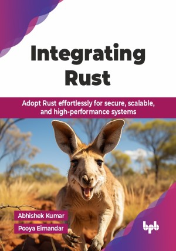

# Integrating Rust

Adopt Rust effortlessly for secure, scalable, and high-performance systems.

This is the repository for [Integrating Rust
](https://bpbonline.com/products/integrating-rust?variant=44315240104136),published by BPB Publications.

## About the Book
Integrating Rust shows you how to create fast, secure software while keeping full control. This book helps you with the knowledge to seamlessly integrate Rust into your existing development workflow, using its power for high-performance systems programming and beyond.

This book is your go-to guide for bringing Rust into your tech stack to build secure, high-performance software. Designed for developers and tech leads, this book offers tools and insights for seamlessly adopting Rust in multi-language environments, modernizing workflows, and optimizing legacy systems. It explains Rust's type system and safety features while providing step-by-step examples for working with C, C++, databases, embedded systems, and WebAssembly. Learn to replace critical components, design efficient systems, and enhance web and cloud applications. This book contains practical tips to help you achieve scalability, reliability, and top-notch performance.

By the end of this book, you will be well-equipped to integrate Rust into your projects, avoid common mistakes, and deliver efficient, secure software aligned with modern standards.

## What You Will Learn
• Optimize legacy systems by rewriting performance-critical components in Rust.

• Integrate Rust with existing C, C++, and WebAssembly projects.

• Leverage Rust’s safety features for secure, reliable software development.

• Use Rust’s concurrency model for multi-threaded and distributed systems.

• Implement Rust in web, database embedded systems, and cloud-based applications.

• Master Rust’s ecosystem, tools, and best development practices.
